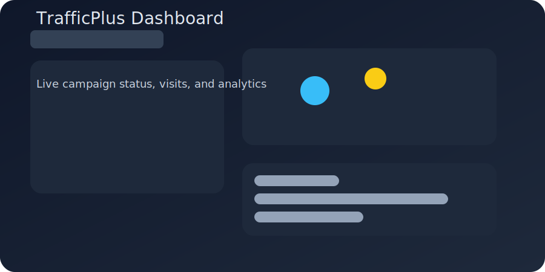
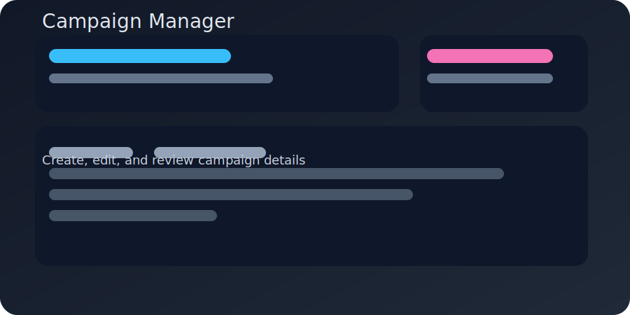
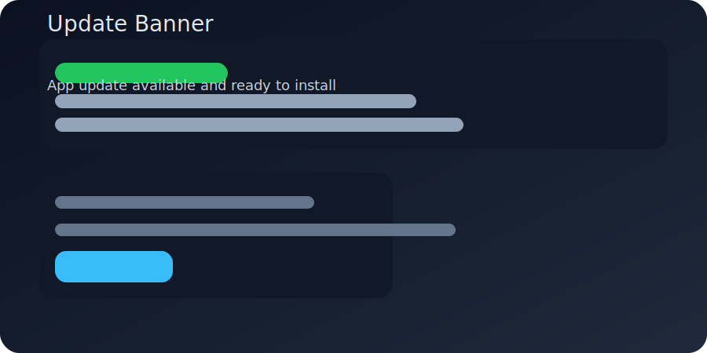

# TrafficPlus Desktop

TrafficPlus Desktop is a desktop marketing automation tool for publishers, freelancers, and digital marketers.

It lets you launch traffic campaigns, route sessions through proxies, and track visits from real browser sessions with built-in analytics.

## Why TrafficPlus Desktop

- Manage multiple campaigns from a single dashboard.
- Send traffic to landing pages, Fiverr gigs, Upwork/Kwork listings, or any website URL.
- Use search-based traffic or direct targeting for marketplace results.
- Monitor `visitsReceived` and campaign performance in real time.
- Automatically deliver updates using GitHub Releases.

## Core features

- **Campaign Builder**: configure direct URL, keyword search, or freelance listing campaigns.
- **Search Traffic**: run keyword-driven sessions for Google, DuckDuckGo, and other search engines.
- **Freelancer Targeting**: visit Fiverr, Upwork, and Kwork listings using seller names and item URLs.
- **Proxy Support**: rotate proxies per slot or assign a shared proxy across all slots.
- **Live analytics**: track current visits, top campaigns, visits received, and campaign status.
- **Auto-update**: install updates automatically from GitHub Releases.
- **Responsive UI**: desktop app views adapt to smaller screens and modal forms remain usable.

## How it works

TrafficPlus Desktop is built with Electron and React.

- The renderer provides the campaign manager, analytics pages, and settings UI.
- The Electron main process handles app packaging, update checks, and release integration.
- `electron-updater` checks GitHub Releases and downloads new installers automatically.
- Campaign data is stored locally and synced to the UI so users can review visit performance.

## Screenshots







> These demo illustrations are stored in the repo under `public/screenshots/`. Replace them with real app exports as screenshots become available.

## Quick start

Install dependencies:

```sh
npm install
```

Start the UI development server:

```sh
npm run dev
```

Open the Electron app in development mode:

```sh
npm run electron:dev
```

Build the app for release:

```sh
npm run electron:build
```

## Available scripts

- `npm run dev` — start Vite development server.
- `npm run electron:dev` — start Vite and Electron together.
- `npm run build` — build the web renderer.
- `npm run electron:build` — package the Electron app with `electron-builder`.
- `npm run lint` — run ESLint across the project.

## Release workflow

This repository uses GitHub Actions to build and publish releases whenever a semantic version tag is pushed.

### Publish a release

1. Commit your code.
2. Update `version` in `package.json` if needed.
3. Create and push a tag:

```sh
git tag v1.0.0
git push origin v1.0.0
```

4. GitHub Actions will build macOS, Windows, and Linux installers and publish them to the release.

### Release workflow config

The release workflow file is `.github/workflows/publish-release.yml`.

It runs on tag pushes matching `v*.*.*` and uses `electron-builder --publish always`.

### Required secret

Add a repository secret named `GH_TOKEN`:

- Create a GitHub personal access token with `repo` scope.
- Add it under Settings → Secrets and variables → Actions.
- Use the name `GH_TOKEN`.

## Auto-update behavior

The app is configured to use GitHub Releases as the update provider.

- The installed app checks for updates automatically.
- When a release is available, it downloads the update in the background.
- Users are prompted or automatically restarted to complete installation.

## Packaging details

The Electron builder configuration lives in `package.json`:

- `appId`: `com.trafficplus.app`
- `productName`: `TrafficPlus`
- `publish.provider`: `github`
- `publish.owner`: `gooxapps`
- `publish.repo`: `TrafficPlus-Desktop`
- Output directory: `release/`

## Development notes

- Use `electron:dev` when making UI or campaign workflow changes.
- Use `electron:build` to confirm package output and publisher settings.
- Replace placeholder screenshots with real local images in the repo for better README presentation.

## Contributing

1. Fork the repository.
2. Create a branch for your feature or fix.
3. Install dependencies and run the app locally.
4. Commit with a descriptive message.
5. Open a pull request.

## Troubleshooting

- If release publishing fails, confirm `GH_TOKEN` has correct repo permissions.
- If auto-update does not appear, verify GitHub Releases contains the app artifacts.
- Use `npm run electron:build` locally to validate packaging before tagging.

## License

This project is available under the terms defined by the repository owner.
